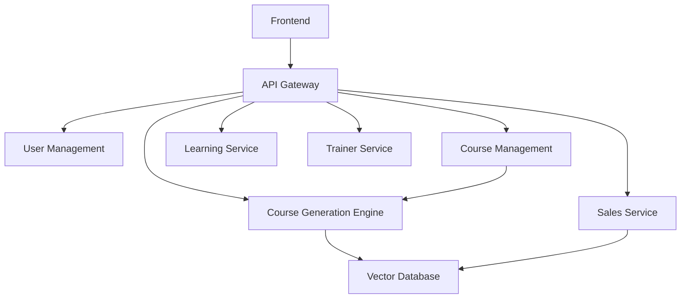

# Architecture Components

This directory contains detailed documentation for each major component of the Dynamic English Course Creator App.

## Core Services

### Frontend & API Gateway
- [Frontend Architecture](./frontend.md) - React-based web application
- [API Gateway](./api-gateway.md) - Entry point for all client requests

### AI & Course Generation
- [Course Generation Engine](./course-generation-engine.md) - AI-powered course creation
- [Vector Database](./vector-db.md) - SOP storage and RAG implementation

### User & Content Management
- [User Management Service](./user-management.md) - Authentication and authorization
- [Course Management Service](./course-management.md) - Course lifecycle and approvals

### Portal Services
- [Sales Service](./sales-service.md) - Client request handling
- [Learning Service](./learning-service.md) - Student portal backend
- [Trainer Service](./trainer-service.md) - Trainer portal backend

## Component Dependencies

## Common Patterns
- All services follow microservice architecture
- JWT-based authentication
- Event-driven communication
- Caching with Redis
- Monitoring and logging
- Error handling and retries

## Component Status

| Component | Status | Last Updated | Owner |
|-----------|--------|--------------|--------|
| API Gateway | ✅ Complete | 2024-03 | DevOps |
| Course Generation | ✅ Complete | 2024-03 | AI Team |
| User Management | 🚧 In Progress | - | Backend |
| Course Management | 🚧 In Progress | - | Backend |
| Sales Service | 📝 Planned | - | Backend |
| Trainer Service | 📝 Planned | - | Backend |
| Student Service | 📝 Planned | - | Backend | 