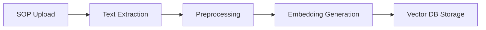
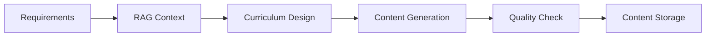

# Course Generation Engine (CGE) Architecture

## Overview
The Course Generation Engine is the core AI-powered service responsible for creating customized English courses from client SOPs and requirements.

## Key Features
- AI-powered curriculum design
- Content generation with CEFR level adaptation
- Exercise and assessment creation
- SOP integration via RAG
- Content packaging and versioning

## Technologies
- Python 3.x
- LLM APIs (OpenAI GPT-4, Anthropic Claude 3, Google Gemini)
- MongoDB/AWS DocumentDB
- Vector Database (Milvus/Pinecone)
- Hugging Face Transformers

## System Components
### 1. SOP Processing Pipeline

### 2. Course Generation Pipeline

## Integration Points
- Sales Service (SOP intake)
- Course Management Service (review workflow)
- Vector Database (RAG queries)
- Content Storage (MongoDB)

## Performance Metrics
- Course generation time: < 30 minutes
- RAG query latency: < 500ms
- Content quality score: > 4.5/5
- Error rate: < 1% 