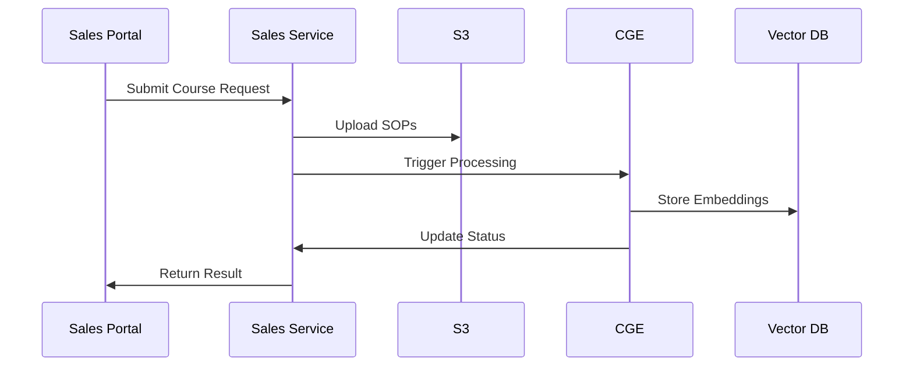

# Sales Service Architecture

## Overview
The Sales Service manages the client course request lifecycle, from initial inquiry to course generation handoff, including SOP document handling and request tracking.

## Core Features
- Course request management
- SOP document handling
- Client communication tracking
- Request status management
- Integration with Course Generation Engine

## Technologies
- Python/FastAPI
- PostgreSQL
- AWS S3 for SOP storage
- Redis for caching
- AWS SQS/SNS for event handling

## Data Model
```sql
-- Course requests
CREATE TABLE course_requests (
    id SERIAL PRIMARY KEY,
    sales_user_id INTEGER REFERENCES users(id),
    company_name VARCHAR(200) NOT NULL,
    industry VARCHAR(100),
    contact_person VARCHAR(200) NOT NULL,
    contact_email VARCHAR(255) NOT NULL,
    contact_phone VARCHAR(20),
    cohort_size INTEGER NOT NULL,
    current_cefr VARCHAR(10) NOT NULL,
    target_cefr VARCHAR(10) NOT NULL,
    training_objectives TEXT NOT NULL,
    pain_points TEXT,
    specific_requirements TEXT,
    course_length_hours INTEGER,
    delivery_method VARCHAR(50),
    preferred_schedule TEXT,
    priority VARCHAR(20) NOT NULL,
    status VARCHAR(50) DEFAULT 'draft',
    created_at TIMESTAMP DEFAULT CURRENT_TIMESTAMP,
    updated_at TIMESTAMP DEFAULT CURRENT_TIMESTAMP
);

-- SOP documents
CREATE TABLE sop_documents (
    id SERIAL PRIMARY KEY,
    request_id INTEGER REFERENCES course_requests(id),
    filename VARCHAR(255) NOT NULL,
    s3_key VARCHAR(500) NOT NULL,
    content_type VARCHAR(100) NOT NULL,
    file_size INTEGER NOT NULL,
    processing_status VARCHAR(50) DEFAULT 'pending',
    vector_db_id VARCHAR(100),
    uploaded_at TIMESTAMP DEFAULT CURRENT_TIMESTAMP
);
```

## API Endpoints
```typescript
// Course Requests
GET /course-requests
POST /course-requests
GET /course-requests/:id
PUT /course-requests/:id
POST /course-requests/:id/submit

// SOP Management
POST /course-requests/:id/sop
GET /course-requests/:id/sop/:sopId
DELETE /course-requests/:id/sop/:sopId

// Dashboard & Analytics
GET /dashboard-stats
GET /sales-performance
```

## Event Flow


## Integration Points
- Course Generation Engine
- User Management Service
- Notification Service
- Analytics Service

## Monitoring & Alerts
- Request processing time
- SOP upload success rate
- Processing pipeline status
- Error rates by stage
- API endpoint performance 