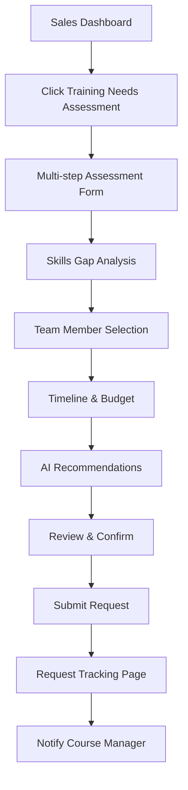
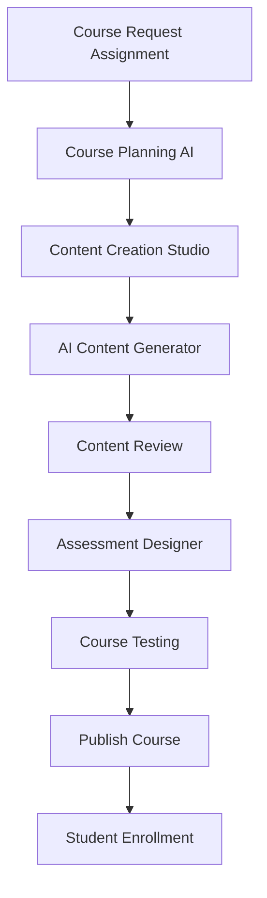
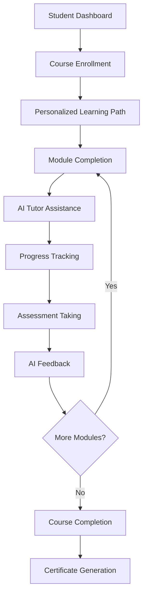

# AI Language Learning Platform UI/UX Specification

## Introduction

This document defines the user experience goals, information architecture, user flows, and visual design specifications for the AI Language Learning Platform's user interface. It serves as the foundation for visual design and frontend development, ensuring a cohesive and user-centered experience.

### Overall UX Goals & Principles

### Target User Personas

- **Sales Representatives:** Business professionals who need to identify training needs and manage course requests for their organizations
- **Course Managers:** Educational administrators who review, approve, and monitor course creation and delivery
- **Trainers:** Subject matter experts who create and deliver learning content using AI assistance
- **Students:** Learners who consume educational content and track their progress through AI-powered personalized learning paths
- **System Administrators:** Technical staff who manage platform configuration, user access, and system monitoring

### Usability Goals

- **Ease of learning:** New users can complete core tasks within 5 minutes of onboarding
- **Efficiency of use:** Power users can complete frequent tasks with minimal clicks (< 3 clicks for common actions)
- **Error prevention:** Clear validation and confirmation for destructive actions with AI-powered guidance
- **Memorability:** Infrequent users can return without relearning due to intuitive navigation patterns
- **Accessibility:** Full WCAG 2.1 AA compliance with screen reader optimization

### Design Principles

1. **AI-First Experience** - Leverage AI guidance throughout the user journey without overwhelming the interface
2. **Progressive disclosure** - Show only what's needed, when it's needed, with AI-powered recommendations
3. **Consistent patterns** - Use familiar UI patterns throughout the application with shadcn/ui components
4. **Immediate feedback** - Every action should have clear, immediate response with AI-powered insights
5. **Accessible by default** - Design for all users from the start with comprehensive accessibility features

### Change Log

| Date | Version | Description | Author |
| :--- | :------ | :---------- | :----- |
| 2025-01-16 | 1.0 | Initial comprehensive frontend specification | BMAD Master |

## Information Architecture (IA)

### Site Map / Screen Inventory

```mermaid
graph TD
    A[Authentication] --> B[Role-Based Dashboard]
    B --> C[Sales Portal]
    B --> D[Course Manager Portal]
    B --> E[Trainer Portal]
    B --> F[Student Portal]
    B --> G[Admin Portal]
    
    C --> C1[Training Needs Assessment]
    C --> C2[Course Request Wizard]
    C --> C3[Request Status Tracking]
    C --> C4[Team Management]
    C --> C5[Analytics Dashboard]
    
    D --> D1[Request Review Queue]
    D --> D2[Agent Health Monitor]
    D --> D3[Workflow Status Tracker]
    D --> D4[Course Approval System]
    D --> D5[Quality Assurance Tools]
    
    E --> E1[Course Creation Studio]
    E --> E2[AI Content Generator]
    E --> E3[Curriculum Builder]
    E --> E4[Assessment Designer]
    E --> E5[Student Progress Monitor]
    E --> E6[Content Library]
    
    F --> F1[Learning Dashboard]
    F --> F2[Course Catalog]
    F --> F3[Active Courses]
    F --> F4[Progress Tracking]
    F --> F5[AI Tutor Chat]
    F --> F6[Certificates & Achievements]
    
    G --> G1[User Management]
    G --> G2[System Configuration]
    G --> G3[Agent Management]
    G --> G4[Analytics & Reporting]
    G --> G5[Platform Settings]
```

### Navigation Structure

**Primary Navigation:** Role-based sidebar with collapsible sections, persistent across all portal views

**Secondary Navigation:** Contextual tabs and breadcrumbs within each portal section

**Breadcrumb Strategy:** Hierarchical navigation showing current location with quick access to parent sections

## User Flows

### Sales Training Needs Assessment

**User Goal:** Identify and document training requirements for their organization

**Entry Points:** Sales dashboard, direct link from email notifications, team management page

**Success Criteria:** Complete needs assessment submitted and routed to appropriate course manager

#### Flow Diagram

**Edge Cases & Error Handling:**
- Incomplete team data: AI-powered suggestions for missing information
- Budget constraints: Alternative course format recommendations
- Timeline conflicts: Automated scheduling assistance

### Course Creation Workflow

**User Goal:** Create comprehensive course content with AI assistance

**Entry Points:** Trainer dashboard, course request assignment, content library

**Success Criteria:** Complete course published and ready for student enrollment

#### Flow Diagram

**Edge Cases & Error Handling:**
- AI generation failures: Manual creation tools with templates
- Content quality issues: AI-powered quality assessment with suggestions
- Technical difficulties: Auto-save with recovery options

### Student Learning Journey

**User Goal:** Complete assigned courses and track progress through personalized learning paths

**Entry Points:** Student dashboard, course notifications, mobile app

**Success Criteria:** Course completion with certification and skill verification

#### Flow Diagram

**Edge Cases & Error Handling:**
- Learning difficulties: AI tutor escalation to human instructor
- Technical issues: Offline mode with sync capabilities
- Assessment failures: Adaptive retry with additional support

## Wireframes & Mockups

**Primary Design Files:** Figma workspace with component library and design system

### Key Screen Layouts

#### Sales Training Needs Assessment

**Purpose:** Streamlined multi-step form for identifying training requirements

**Key Elements:**
- Progress indicator showing current step
- AI-powered suggestions sidebar
- Skills gap analysis with visual charts
- Team member selection with role mapping
- Budget calculator with cost estimates

**Interaction Notes:** Auto-save on each step, AI recommendations update in real-time

#### Course Creation Studio

**Purpose:** Comprehensive course authoring environment with AI assistance

**Key Elements:**
- Split-screen editor with preview
- AI content generator panel
- Drag-and-drop curriculum builder
- Real-time collaboration indicators
- Version control sidebar

**Interaction Notes:** AI suggestions appear contextually, real-time preview updates

#### Student Learning Dashboard

**Purpose:** Personalized learning hub with progress tracking and AI tutor

**Key Elements:**
- Progress visualization with skill trees
- Active course cards with completion status
- AI tutor chat interface
- Upcoming deadlines and recommendations
- Achievement badges and certifications

**Interaction Notes:** AI tutor provides contextual help, progress updates animate

## Component Library / Design System

**Design System Approach:** Extend existing shadcn/ui component library with custom learning-specific components

### Core Components

#### AI Chat Interface

**Purpose:** Consistent AI interaction component across all portals

**Variants:** Compact, Expanded, Overlay, Sidebar

**States:** Active, Thinking, Error, Offline

**Usage Guidelines:**
- Use Compact for quick questions
- Expanded for detailed course creation assistance
- Overlay for contextual help during assessments

#### Progress Tracker

**Purpose:** Visual progress indication for courses, assessments, and workflows

**Variants:** Linear, Circular, Skill Tree, Timeline

**States:** Not Started, In Progress, Completed, Blocked

**Usage Guidelines:**
- Linear for simple sequential progress
- Skill Tree for complex learning paths
- Timeline for course creation workflows

#### Course Card

**Purpose:** Consistent course representation across all portals

**Variants:** Grid, List, Compact, Detailed

**States:** Available, Enrolled, In Progress, Completed, Locked

**Usage Guidelines:**
- Grid for course catalogs
- List for dashboard recent items
- Detailed for course landing pages

#### Assessment Builder

**Purpose:** Interactive assessment creation with AI assistance

**Variants:** Multiple Choice, Essay, Practical, Adaptive

**States:** Draft, Preview, Published, Archived

**Usage Guidelines:**
- Multiple Choice for knowledge checks
- Essay for critical thinking
- Practical for hands-on skills
- Adaptive for personalized difficulty

#### Agent Health Monitor

**Purpose:** Real-time status monitoring for AI agents

**Variants:** Compact, Detailed, List, Grid

**States:** Healthy, Warning, Error, Offline

**Usage Guidelines:**
- Compact for dashboard widgets
- Detailed for troubleshooting
- List for multiple agent overview

## Branding & Style Guide

### Visual Identity

**Brand Guidelines:** Professional, modern, AI-forward aesthetic with educational warmth

### Color Palette

| Color Type    | Hex Code  | Usage                                    |
| :------------ | :-------- | :--------------------------------------- |
| **Primary**   | #1E40AF   | Main CTAs, active states, brand elements |
| **Secondary** | #6B7280   | Supporting text, secondary actions       |
| **Accent**    | #10B981   | Success states, progress indicators      |
| **Success**   | #059669   | Positive feedback, completions           |
| **Warning**   | #D97706   | Attention needed, pending states         |
| **Error**     | #DC2626   | Errors, failures, destructive actions    |
| **AI**        | #8B5CF6   | AI-related elements, suggestions         |
| **Neutral**   | #F9FAFB   | Backgrounds, cards, subtle elements      |

### Typography

**Font Families:**
- **Primary:** Inter (sans-serif)
- **Secondary:** JetBrains Mono (monospace for code)
- **Accent:** Poppins (headings and emphasis)

**Type Scale:**
| Element | Size | Weight | Line Height |
|:--------|:-----|:-------|:------------|
| H1 | 2.5rem | 700 | 1.2 |
| H2 | 2rem | 600 | 1.3 |
| H3 | 1.5rem | 600 | 1.4 |
| H4 | 1.25rem | 500 | 1.4 |
| Body | 1rem | 400 | 1.6 |
| Small | 0.875rem | 400 | 1.5 |

### Iconography

**Icon Library:** Lucide React with custom learning-specific icons

**Usage Guidelines:** Consistent 24px sizing, use outline style for interactive elements, filled for status indicators

### Spacing & Layout

**Grid System:** 12-column CSS Grid with Tailwind utilities

**Spacing Scale:** 8px base unit (4px, 8px, 16px, 24px, 32px, 48px, 64px)

## Accessibility Requirements

### Compliance Target

**Standard:** WCAG 2.1 AA compliance with progressive enhancement to AAA where feasible

### Key Requirements

**Visual:**
- Color contrast ratios: 4.5:1 for normal text, 3:1 for large text
- Focus indicators: 2px solid outline with high contrast
- Text sizing: Minimum 16px base, scalable to 200% without horizontal scrolling

**Interaction:**
- Keyboard navigation: Full tab order with skip links
- Screen reader support: Semantic HTML with comprehensive ARIA labels
- Touch targets: Minimum 44px for mobile interactions

**Content:**
- Alternative text: Descriptive alt text for all images and interactive elements
- Heading structure: Logical hierarchy with no skipped levels
- Form labels: Explicit labels for all form controls with error descriptions

### Testing Strategy

- Automated accessibility testing with axe-core
- Manual keyboard navigation testing
- Screen reader testing with NVDA and VoiceOver
- User testing with disabled community members

## Responsiveness Strategy

### Breakpoints

| Breakpoint | Min Width | Max Width | Target Devices           |
| :--------- | :-------- | :-------- | :----------------------- |
| Mobile     | 320px     | 767px     | Smartphones, small tablets |
| Tablet     | 768px     | 1023px    | Tablets, small laptops    |
| Desktop    | 1024px    | 1439px    | Laptops, desktop monitors |
| Wide       | 1440px    | -         | Large monitors, 4K displays |

### Adaptation Patterns

**Layout Changes:** 
- Mobile: Single column with stacked navigation
- Tablet: Two-column with collapsible sidebar
- Desktop: Full three-column with persistent navigation

**Navigation Changes:**
- Mobile: Hamburger menu with slide-out drawer
- Tablet: Collapsible sidebar with icon labels
- Desktop: Full sidebar with text labels and submenus

**Content Priority:**
- Mobile: Progressive disclosure with accordions
- Tablet: Tabbed interfaces for complex content
- Desktop: Side-by-side content with contextual panels

## Animation & Micro-interactions

### Motion Principles

- **Purposeful:** Every animation serves a functional purpose
- **Responsive:** Animations adapt to device performance
- **Respectful:** Honor user preferences for reduced motion
- **Delightful:** Subtle animations enhance user experience

### Key Animations

- **Page Transitions:** Smooth fade-in/out (300ms, ease-out)
- **Loading States:** Skeleton screens with shimmer effect (1s loop)
- **Progress Updates:** Smooth progress bar animations (500ms, ease-in-out)
- **AI Thinking:** Pulsing indicator with typing simulation (variable duration)
- **Success Feedback:** Checkmark animation with scale effect (400ms, bounce)

## Performance Considerations

### Performance Goals

- **Page Load:** < 2 seconds for initial page load
- **Interaction Response:** < 100ms for button clicks and navigation
- **Animation FPS:** 60fps for all animations on desktop, 30fps minimum on mobile

### Design Strategies

- Component lazy loading for non-critical sections
- Image optimization with Next.js Image component
- Code splitting by route and feature
- Efficient state management with minimal re-renders
- CDN integration for static assets

## Next Steps

### Immediate Actions

1. **Create missing portal pages** - Trainer, Student, and Admin portals
2. **Implement advanced components** - AI chat interface, progress tracker, assessment builder
3. **Set up comprehensive testing** - Component tests, accessibility tests, performance tests
4. **Enhance existing components** - Add missing states, improve accessibility
5. **Create parallel development workflow** - Agent assignment for different frontend areas

### Design Handoff Checklist

- [x] All user flows documented
- [x] Component inventory complete
- [x] Accessibility requirements defined
- [x] Responsive strategy clear
- [x] Brand guidelines incorporated
- [x] Performance goals established
- [ ] Component library extended with learning-specific components
- [ ] Testing framework implementation
- [ ] Parallel development agent strategy defined

## Parallel Development Strategy

### Recommended Agent Specializations

1. **UI/UX Specialist Agent** - Focus on component library enhancement and design system
2. **Portal Development Agent** - Implement missing portal pages (Trainer, Student, Admin)
3. **Assessment & Learning Agent** - Create interactive learning components and assessment tools
4. **Performance & Accessibility Agent** - Optimize performance and ensure accessibility compliance
5. **Testing & Quality Agent** - Implement comprehensive testing framework and quality assurance

### Component Development Priorities

**Phase 1 (Immediate):**
- Complete Trainer Portal with course creation studio
- Implement Student Portal with learning dashboard
- Create Admin Portal with system management tools

**Phase 2 (Short-term):**
- Enhanced AI chat interface across all portals
- Comprehensive progress tracking components
- Interactive assessment builder tools

**Phase 3 (Medium-term):**
- Advanced analytics and reporting components
- Real-time collaboration features
- Mobile-optimized learning experience

This specification provides a comprehensive foundation for creating a world-class AI-powered learning platform frontend that leverages your existing shadcn/ui foundation while addressing all the critical gaps identified in the current implementation.