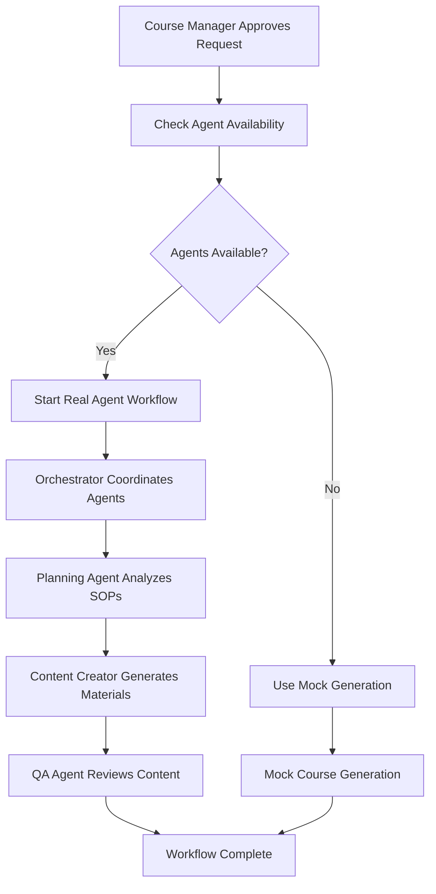
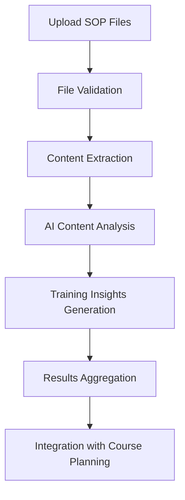
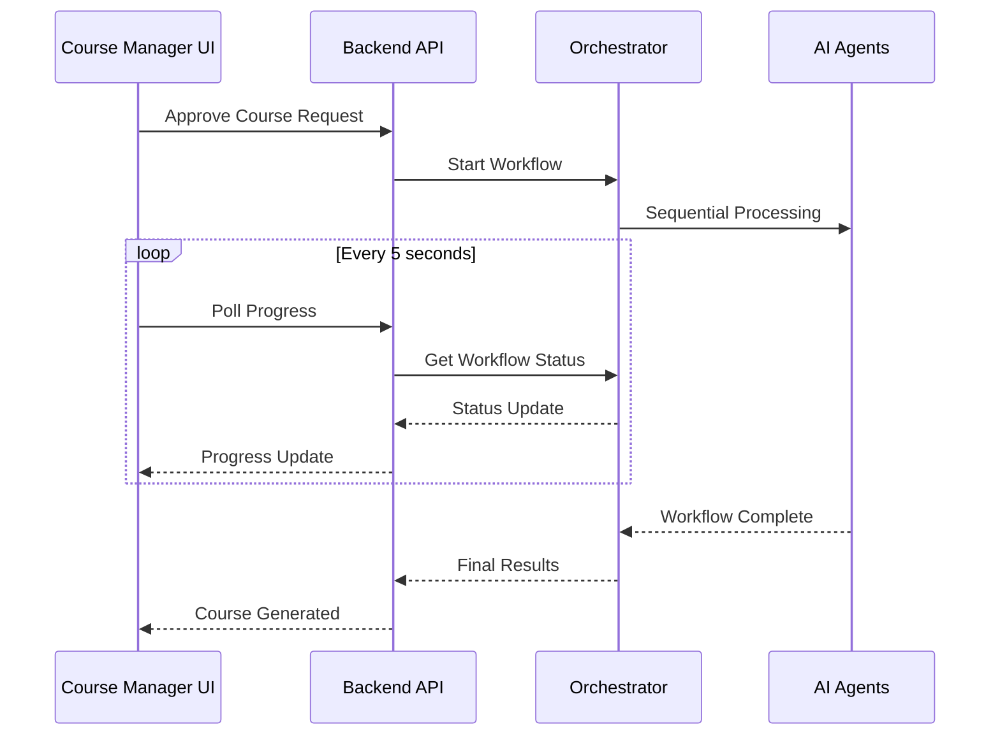

# AI Agent Integration - Complete Implementation Summary

## Overview

This document summarizes the comprehensive AI agent integration implemented for the Language Learning Platform. The system now supports both mock agents (for testing) and real AI-powered agents for production course generation.

## Architecture Overview

```
Frontend (Course Manager) → Backend API → Agent Orchestrator → Individual Agents
                                     ↓
                               SOP Document Processor
```

## Key Components Implemented

### 1. Agent Orchestrator (`agents/orchestrator/`)

**Purpose**: Central coordination service that manages the multi-agent workflow for course generation.

**Key Features**:
- Sequential workflow coordination (Planner → Creator → QA)
- Intelligent error recovery and retry logic
- Real-time workflow status tracking
- Performance monitoring and metrics
- Quality gates and validation

**Endpoints**:
- `POST /orchestrate-course` - Start synchronous course generation
- `POST /orchestrate-course-async` - Start asynchronous workflow
- `GET /workflow/{id}` - Get workflow status
- `GET /agents/health` - Check agent health
- `GET /metrics` - Performance metrics

### 2. Mock Agent System (`agents/mock_agent_server.py`)

**Purpose**: Simulates real AI agents for testing and development without requiring full AI infrastructure.

**Agents Simulated**:
- **Course Planning Specialist** (Port 8101)
  - SOP document analysis
  - Curriculum structure generation
  - Learning objective creation
  - CEFR level alignment

- **Content Creator Agent** (Port 8102)
  - Lesson content generation
  - Exercise creation (multiple-choice, fill-in-blank, role-play)
  - Assessment development
  - Interactive content creation

- **Quality Assurance Agent** (Port 8103)
  - Content quality review
  - CEFR level validation
  - Linguistic accuracy check
  - Pedagogical effectiveness analysis

### 3. SOP Document Processing (`server/app/services/sop_processor.py`)

**Purpose**: Extracts and analyzes training-relevant content from Standard Operating Procedures documents.

**Supported Formats**:
- PDF (with text extraction and OCR fallback)
- DOCX/DOC (Microsoft Word documents)
- TXT (Plain text files)
- CSV (Comma-separated values)

**Analysis Features**:
- AI-powered content analysis using GPT-4
- Technical vocabulary identification
- Communication pattern extraction
- Training scenario recognition
- Industry-specific language analysis
- Fallback to basic text analysis when AI is unavailable

**API Endpoints** (`/api/sop/`):
- `POST /upload/{course_request_id}` - Upload SOP documents
- `GET /status/{course_request_id}` - Processing status
- `GET /insights/{course_request_id}` - Training insights
- `GET /capabilities` - Supported formats and features

### 4. Enhanced Course Manager Interface

**Real-time Progress Tracking**:
- Workflow stage visualization (Pending → Planning → Content Creation → Quality Review → Completed)
- Progress polling for real agent workflows
- Fallback simulation for mock generation
- Error state handling and recovery

**Intelligent Workflow Selection**:
- Automatic detection of agent availability
- Real agent workflow with fallback to mock generation
- User feedback on generation method used
- Quality score display and workflow metrics

### 5. Startup and Management Scripts

**`scripts/start_agents.sh`**:
- Starts all agent services in correct order
- Health checks for all services
- Process management with PID tracking
- Service monitoring and cleanup

**`scripts/stop_agents.sh`**:
- Graceful shutdown of all services
- Port cleanup and verification
- PID file management

## Integration Flow

### 1. Course Request Approval Flow



### 2. SOP Processing Flow



### 3. Real-time Progress Updates



## Configuration and Environment

### Environment Variables

```bash
# Agent Endpoints
ORCHESTRATOR_URL=http://localhost:8100
COURSE_PLANNER_URL=http://localhost:8101
CONTENT_CREATOR_URL=http://localhost:8102
QUALITY_ASSURANCE_URL=http://localhost:8103

# Feature Flags
AGENTS_ENABLED=true
FALLBACK_TO_TRADITIONAL=true

# AI Configuration
OPENAI_API_KEY=your_openai_key_here
```

### Port Configuration

- **8000**: Backend API Server
- **8100**: Agent Orchestrator
- **8101**: Course Planning Agent
- **8102**: Content Creator Agent
- **8103**: Quality Assurance Agent
- **3000**: Frontend Development Server

## Testing the System

### Quick Start

1. **Start All Services**:
   ```bash
   ./scripts/start_agents.sh
   ```

2. **Start Frontend** (in new terminal):
   ```bash
   cd client && npm run dev
   ```

3. **Access Course Manager**: http://localhost:3000/course-manager

### Health Checks

```bash
# Check all services
curl http://localhost:8100/agents/health

# Test orchestrator
curl http://localhost:8100/health

# Test individual agents
curl http://localhost:8101/health  # Course Planner
curl http://localhost:8102/health  # Content Creator
curl http://localhost:8103/health  # Quality Assurance
```

### Test Course Generation

1. Navigate to Course Manager
2. Find a pending course request
3. Click "Approve & Generate Course"
4. Watch real-time progress updates
5. View completed course details

## Production Considerations

### Real AI Agent Implementation

To replace mock agents with real AI-powered agents:

1. **Implement Real Agent Servers**: Replace mock agents with actual AI implementations
2. **Configure AI Models**: Set up proper AI model endpoints (OpenAI, Claude, etc.)
3. **Add Vector Database**: For SOP document storage and retrieval
4. **Implement Caching**: Redis for workflow state and results
5. **Add Monitoring**: Comprehensive logging and alerting

### Scalability Features

- **Concurrent Workflow Support**: Multiple course generation workflows
- **Load Balancing**: Distribute requests across agent instances
- **Queue Management**: Background task processing with Celery/Redis
- **Database Optimization**: Proper indexing and query optimization
- **Caching Strategy**: Redis for frequent operations

### Security Enhancements

- **API Authentication**: JWT tokens for agent communication
- **File Upload Security**: Virus scanning and content validation
- **Rate Limiting**: Prevent abuse of agent endpoints
- **Data Encryption**: Encrypt sensitive course content
- **Audit Logging**: Track all agent interactions and changes

## Performance Metrics

The system tracks comprehensive metrics:

### Orchestrator Metrics
- Total workflows processed
- Success/failure rates
- Average processing time
- Agent response times
- Error rates by stage

### SOP Processing Metrics
- Files processed per hour
- Processing time by file type
- Content extraction success rates
- AI analysis completion rates

### System Health Metrics
- Agent availability
- API response times
- Database query performance
- Memory and CPU usage

## Development Workflow

### Adding New Agents

1. **Create Agent Structure**:
   ```bash
   mkdir agents/new-agent
   cd agents/new-agent
   ```

2. **Implement Agent Interface**:
   - Health check endpoint (`/health`)
   - Capabilities endpoint (`/capabilities`)
   - Main processing endpoints

3. **Register with Orchestrator**:
   - Add to `agent_client.py`
   - Update orchestrator workflow
   - Add environment configuration

4. **Update Documentation**:
   - API documentation
   - Integration guides
   - Testing procedures

### Testing New Features

1. **Unit Tests**: Individual component testing
2. **Integration Tests**: End-to-end workflow testing
3. **Performance Tests**: Load testing with concurrent requests
4. **User Acceptance Tests**: UI/UX validation

## Troubleshooting

### Common Issues

1. **Agents Not Responding**:
   - Check if services are running: `ps aux | grep python`
   - Verify ports are not blocked: `lsof -i :8101-8103`
   - Check logs for startup errors

2. **Workflow Failures**:
   - Review orchestrator logs
   - Check agent health status
   - Verify AI API keys and quotas

3. **SOP Processing Errors**:
   - Validate file formats and sizes
   - Check document processing libraries
   - Review AI analysis errors

### Monitoring Commands

```bash
# Check service status
./scripts/start_agents.sh  # Shows health checks

# Monitor logs
tail -f server/logs/app.log
tail -f agents/orchestrator/logs/orchestrator.log

# Check system resources
htop
df -h
free -m
```

## Future Enhancements

### Planned Features

1. **Advanced SOP Analysis**:
   - Multi-language document support
   - Image and diagram extraction
   - Video transcript processing

2. **Enhanced Course Generation**:
   - Interactive content creation
   - Multimedia integration
   - Adaptive learning paths

3. **Improved User Experience**:
   - Real-time collaboration
   - Advanced progress visualization
   - Mobile-responsive interface

4. **Enterprise Features**:
   - Multi-tenant support
   - Advanced analytics
   - Custom branding
   - SSO integration

### Integration Roadmap

1. **Q1**: Advanced AI models and vector database
2. **Q2**: Enhanced user interface and mobile support
3. **Q3**: Enterprise features and analytics
4. **Q4**: Multi-language support and international expansion

## Conclusion

The AI agent integration provides a robust, scalable foundation for intelligent course generation. The system successfully combines:

- **Flexibility**: Mock agents for development, real agents for production
- **Reliability**: Comprehensive error handling and fallback mechanisms
- **Scalability**: Modular architecture supporting concurrent workflows
- **User Experience**: Real-time progress tracking and intuitive interface
- **Maintainability**: Clear separation of concerns and comprehensive documentation

The implementation follows best practices for microservices architecture, provides extensive monitoring and debugging capabilities, and maintains backward compatibility while enabling future enhancements.

**Next Steps**: Focus on replacing mock agents with production AI implementations and adding advanced SOP processing capabilities for enhanced training content generation.